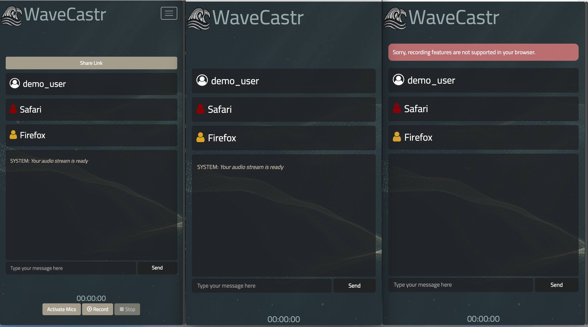
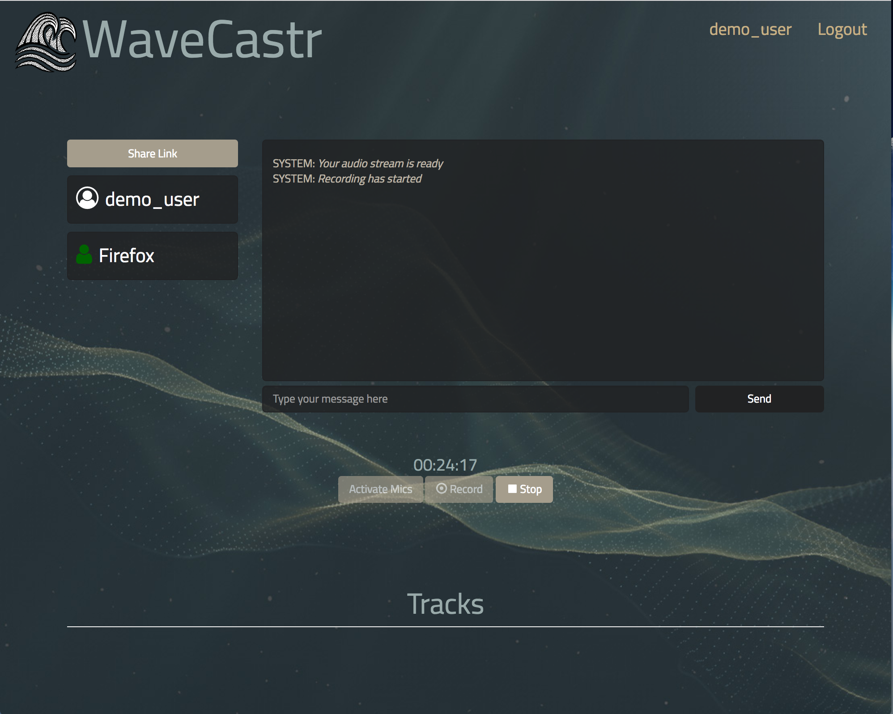
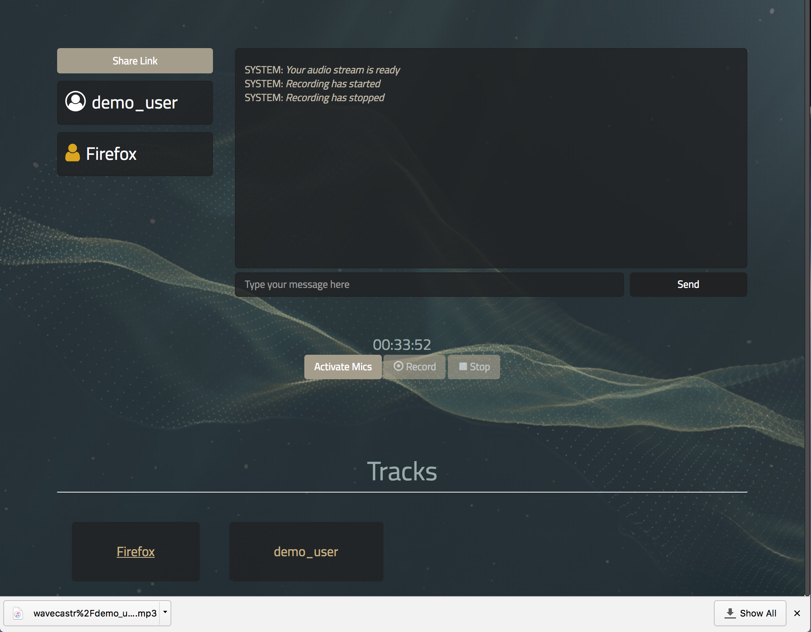

# WaveCastr

A website for capturing high quality audio for podcasts or interviews. WaveCastr records from each participant's local machine and stores it in the cloud. Capturing the audio locally preserves the quality and having each participant's voice on a separate track makes it easy to produce great sounding podcasts with minimal setup.

## Screen Shots

## Using WaveCastr

Every participant will need a recent version of Chrome / Firefox, a microphone, headphones and a voip program (Skype, Google Hangouts etc).

First, the host makes an [account](https://wavecastr.herokuapp.com/users/sign_up) or logs in. Then the host create a new episode and shares the link with the other participants.

After everyone has arrived, the host activates the microphones which prompts users to grant microphone permissions. Simply start recording when everyone is ready. When the podcast is over, the host just presses the stop recording button and all audio files are uploaded to the cloud.

## Built With

* [Ruby on Rails](https://github.com/rails/rails) -- Powers the back end

* [Action Cable](https://github.com/rails/rails/tree/master/actioncable) -- Provides real time asynchronous communication

* [PostgresSQL](https://www.postgresql.org/) -- Primary data store

* [Redis](https://redis.io/) -- Data store for Action Cable

* [Amazon S3](https://aws.amazon.com/s3/) -- Stores audio files

* [Heroku](https://www.heroku.com/) -- Cloud hosting for the application

## Contributing

Features and bug fixes are always welcome.

## License

WaveCastr is released under a [GNU General Public License v3.0](/license.txt).
